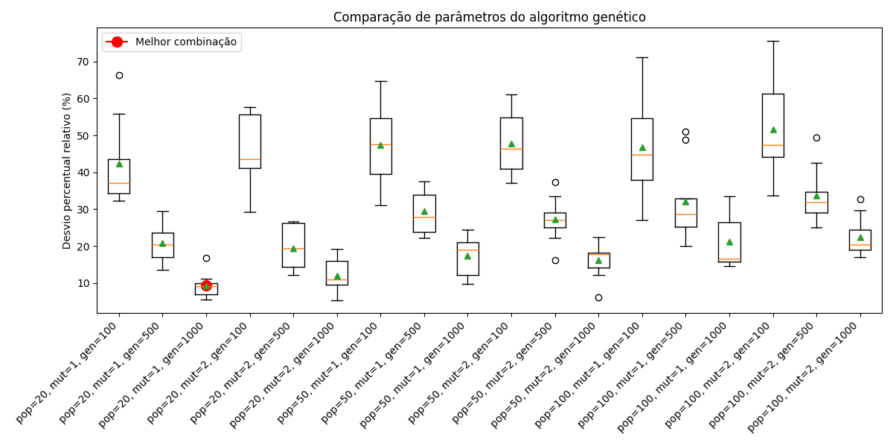

# Calibração de um Algoritmo Genético para CPP (Chinese Postman Problem)

Este repositório contém a calibração de um **algoritmo genético** para resolver instâncias do problema do carteiro chinês (CPP).  
O projeto inclui geração de instâncias, operadores genéticos, execução principal e processo de calibração dos parâmetros.

---

## 📂 Estrutura do Repositório

- **Instances/**  
  Conjunto de arquivos `.txt` com instâncias do problema (grafo com nós e arestas).

- **cpp_generation.py**  
  Script para gerar instâncias de diferentes tamanhos e salvar na pasta `Instances`.

- **reading_cpp.py**  
  Função para leitura das instâncias e construção do grafo em `networkx`.

- **ga_operators.py**  
  Implementação dos operadores genéticos:
  - Geração da população inicial
  - Fitness
  - Seleção por torneio
  - Crossover OX (Order Crossover)
  - Mutação por swap
  - Substituição do pior indivíduo
  - Visualização da solução

- **full_genetic_algorithm.py**  
  Função principal que executa o algoritmo genético completo, recebendo parâmetros como população, probabilidade de mutação e número de gerações.

- **main.py**  
  Exemplo de execução do algoritmo em uma instância específica.

- **results_genetic_algorithm.csv**  
  Arquivo gerado com os resultados do processo de calibração (médias de fitness e desvios percentuais relativos).

- **Figure_1.png**  
  Ilustração dos resultados comparativos entre combinações de parâmetros.

---

## ⚙️ Processo de Calibração

O processo de calibração foi implementado para avaliar diferentes combinações de parâmetros do algoritmo genético:

1. **Seleção de instâncias**  
   - 30% dos arquivos da pasta `Instances` são escolhidos aleatoriamente.

2. **Combinações de parâmetros testadas**  
   - `pop_size = [20, 50, 100]`  
   - `prob_mut = [1, 2]`  
   - `num_gen = [100, 500, 1000]`

   Total: 18 combinações.

3. **Execuções repetidas**  
   - Para cada instância e cada combinação de parâmetros, o algoritmo é executado **5 vezes**.

4. **Cálculo do desvio percentual relativo**  
   - Para cada instância, identifica-se a **melhor solução obtida** (menor fitness).  
   - O desvio percentual relativo é calculado como:

     

\[
     \text{Desvio} = \frac{\text{Média das soluções para a instância} - \text{Melhor solução da instância}}{\text{Melhor solução da instância}} \times 100
     \]

   - Esse valor nunca é negativo, pois a média não pode ser menor que o melhor valor observado.

5. **Armazenamento dos resultados**  
   - Todos os resultados são salvos em `results_genetic_algorithm.csv`.

6. **Identificação da melhor combinação**  
   - A combinação de parâmetros com menor desvio percentual relativo médio é destacada no console e no gráfico.

7. **Visualização**  
   - Um **boxplot** é gerado para comparar os desvios percentuais relativos entre todas as combinações de parâmetros.  
   - A melhor combinação é destacada em vermelho.

---

## 📊 Resultados

Os resultados da calibração podem ser visualizados no arquivo `results_genetic_algorithm.csv` e no boxplot gerado.  
A figura abaixo mostra um exemplo da comparação entre combinações de parâmetros:

---

## 🚀 Como executar

1. Gere instâncias com `cpp_generation.py` ou utilize as já disponíveis em `Instances/`.
2. Execute o algoritmo em uma instância específica com `main.py`.
3. Rode o processo de calibração para avaliar diferentes combinações de parâmetros e gerar o boxplot comparativo.

---

## 📌 Observações

- O projeto utiliza **Python 3**, com dependências: `numpy`, `matplotlib`, `networkx`, `pandas`.
- O processo de calibração é essencial para identificar os parâmetros que melhor equilibram qualidade da solução e custo computacional.

