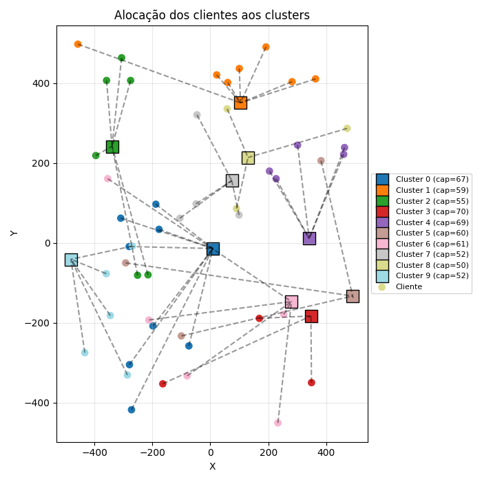

# GRASP para o Problema de Agrupamento Capacitado (CCP)

Este repositório implementa o algoritmo **GRASP (Greedy Randomized Adaptive Search Procedure)** para resolver o **Problema de Agrupamento Capacitado (Capacitated Clustering Problem - CCP)**.  

O CCP consiste em atribuir clientes a clusters de forma que:
- Cada cliente seja alocado a exatamente um cluster.
- A capacidade de cada cluster não seja excedida.
- O custo total (distância cliente–cluster) seja minimizado.

---

## 📂 Estrutura do Repositório

- **`main.py`** → Script principal que executa o GRASP, gera a curva de convergência e plota a atribuição final dos clientes.
- **`grasp_ccp_operators.py`** → Funções auxiliares:
  - Leitura de instâncias (`ccp_reading`)
  - Cálculo da matriz de distâncias (`distance_matrix_ccp`)
  - Fase de construção (`construction_phase_ccp`)
  - Movimentos de busca local (`reallocation_ccp`, `swap_ccp`)
  - Cálculo do custo (`cost_solution_ccp`)
  - Plotagem da solução (`plot_clusters_assignment`)
- **`ccp_instances_generator.py`** → Gerador de instâncias de teste para o CCP.
- **`ccp-1.txt`** → Exemplo de instância (clusters e clientes com coordenadas e capacidades).
- **`Figure_1.png`** → Exemplo de saída gráfica mostrando a atribuição dos clientes aos clusters.

---

## 🔧 Operadores do GRASP para o CCP

| Operador                  | Descrição                                                                 | Objetivo                                                                 |
|----------------------------|---------------------------------------------------------------------------|---------------------------------------------------------------------------|
| **Leitura da instância** (`ccp_reading`) | Lê arquivo `.txt` com coordenadas, demandas dos clientes e capacidades dos clusters. | Preparar os dados de entrada para o algoritmo. |
| **Matriz de distâncias** (`distance_matrix_ccp`) | Calcula a distância euclidiana entre cada cliente e cada cluster. | Fornecer os custos básicos para construção e avaliação de soluções. |
| **Custo da solução** (`cost_solution_ccp`) | Soma das distâncias cliente–cluster de uma atribuição. | Avaliar a qualidade da solução atual. |
| **Construção** (`construction_phase_ccp`) | Atribui clientes a clusters usando lista de candidatos restrita (RCL) com parâmetro `alpha`. | Gerar solução inicial viável e diversificada. |
| **Realocação** (`reallocation_ccp`) | Move um cliente para outro cluster com capacidade suficiente, escolhendo destino via RCL. | Melhorar solução ajustando cargas e reduzindo custo. |
| **Troca (Swap)** (`swap_ccp`) | Troca dois clientes entre clusters diferentes se a capacidade permitir. | Explorar vizinhança e reduzir custo localmente. |
| **Plotagem** (`plot_clusters_assignment`) | Gera gráfico com clusters (quadrados) e clientes (círculos), mostrando conexões. | Visualizar a atribuição final dos clientes aos clusters. |

## 🖼️ Figura 1 – Exemplo de atribuição dos clientes aos clusters

