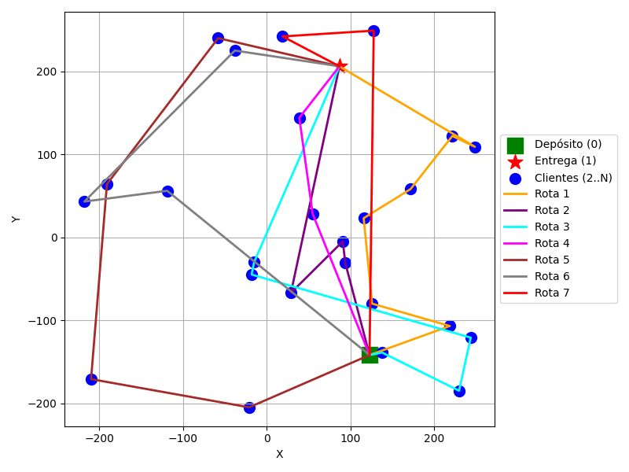

# GRASP para o Open Vehicle Routing Problem (OVRP)

Este repositório implementa uma metaheurística **GRASP (Greedy Randomized Adaptive Search Procedure)** para resolver o **Open Vehicle Routing Problem (OVRP)**.  

No OVRP, os veículos partem de um **depósito**, visitam um conjunto de **clientes** e finalizam suas rotas em um **ponto de entrega**. O objetivo é minimizar o custo total das rotas, respeitando a capacidade dos veículos.

---

## 📂 Estrutura do Repositório

- **OVRP-1.txt** → Instância de teste com coordenadas e demandas dos clientes  
- **grasp_operators.py** → Implementação dos operadores do GRASP (construção, reallocation, swap, 2-opt, etc.)  
- **main.py** → Script principal para execução do GRASP  
- **ovrp_generation.py** → Geração de instâncias do problema  
- **ovrp_reading.py** → Leitura de instâncias do problema  
- **routes.png** → Exemplo de rotas geradas e plotadas  

---

## ⚙️ Funcionamento

1. **Construção inicial (GRASP)**  
   - Gera rotas viáveis usando uma lista de candidatos restrita (RCL).  
2. **Busca local**  
   - Aplica operadores de vizinhança para melhorar a solução inicial.  
3. **Melhor solução global**  
   - Mantém sempre a melhor solução encontrada ao longo das iterações.  

---

## 🛠️ Operadores do GRASP

| Operador        | Descrição                                                                 |
|-----------------|---------------------------------------------------------------------------|
| **Construction** | Constrói rotas iniciais usando RCL e respeitando capacidade dos veículos. |
| **Reallocation** | Move um cliente de uma rota para outra rota com capacidade disponível.    |
| **Swap**         | Troca dois clientes de rotas diferentes, respeitando a capacidade.        |
| **2-opt**        | Otimiza cada rota individualmente, removendo cruzamentos e reduzindo custo.|

---

## 🎨 Visualização

As rotas podem ser plotadas com cores distintas usando `plot_routes`.  
Exemplo de saída gráfica:

