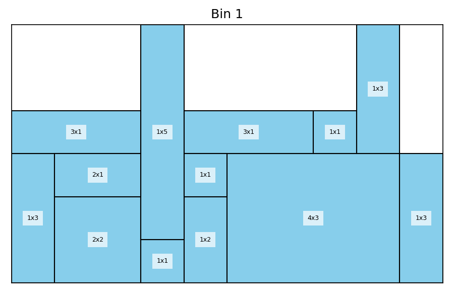
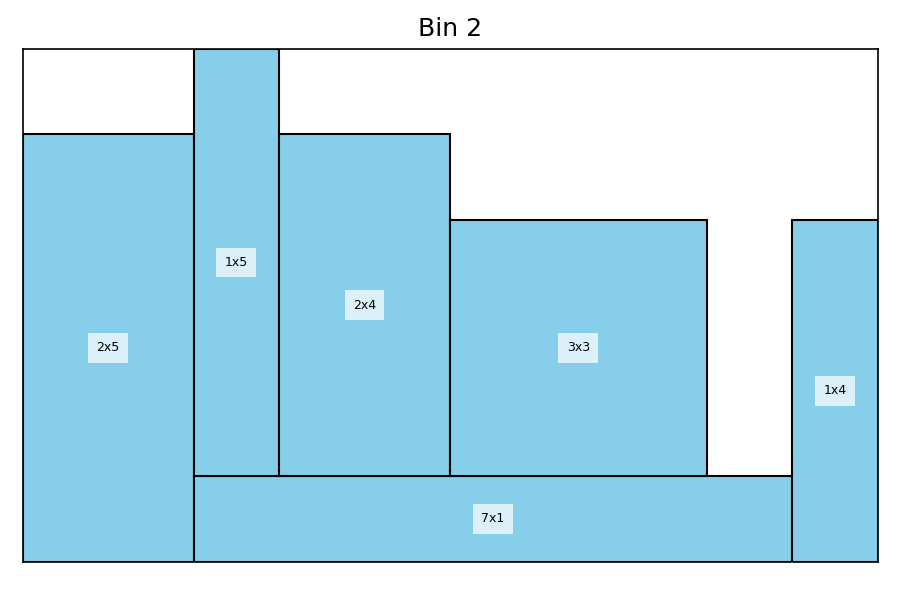

# 🧬 Algoritmo Genético para Bin Packing 2D com Rotações

Este repositório implementa um **Algoritmo Genético (GA)** para resolver o problema de **Bin Packing 2D** com possibilidade de **rotacionar os itens em 90°**.  

O objetivo é empacotar retângulos (itens) em bins de dimensões fixas, minimizando o desperdício de espaço.

---

## 📂 Estrutura do Repositório

- **`main.py`** → Script principal que executa o algoritmo genético.
- **`ga_bp2D_operators.py`** → Implementação dos operadores genéticos:
  - Leitura de instância
  - Geração da população inicial
  - Fitness
  - Seleção
  - Crossover (OX e uniforme)
  - Mutação
  - Replacement
  - Plotagem da solução
- **`bp2D_generating_instances.py`** → Gerador de instâncias de Bin Packing 2D.
- **`bin2d-1.txt`** → Exemplo de instância com itens e dimensões do bin.
- **`best_bin_1.png`, `best_bin_2.png`** → Exemplos de soluções gráficas encontradas pelo GA.

---

## 🔧 Operadores do Algoritmo Genético

| Operador                        | Descrição                                                                 |
|---------------------------------|---------------------------------------------------------------------------|
| **Leitura da instância** (`binpacking2d_reading`) | Lê arquivo `.txt` com itens e dimensões do bin. |
| **População inicial** (`genpop_binpacking2d`) | Gera indivíduos com ordem aleatória e orientação binária dos itens. |
| **Fitness** (`fitness_population_2d`) | Avalia soluções pelo desperdício médio de área nos bins. |
| **Seleção** (`selection`) | Seleção por torneio entre candidatos. |
| **Crossover OX** (`order_crossover`) | Recombina a ordem dos itens mantendo permutação válida. |
| **Crossover uniforme** (`uniform_crossover`) | Recombina orientação dos itens bit a bit. |
| **Crossover combinado** (`combined_crossover`) | Aplica OX na ordem e uniforme na orientação. |
| **Mutação** (`mutation`) | Inverte a orientação de um item aleatório. |
| **Replacement** (`replacement`) | Substitui o pior indivíduo se o filho for melhor. |
| **Plotagem** (`plot_best_solution`) | Gera imagens dos bins com os itens alocados. |

---

## 📊 Exemplo de Solução GA Bin Packing 2D

| Bin 1 | Bin 2 |
|-------|-------|
|  |  |

