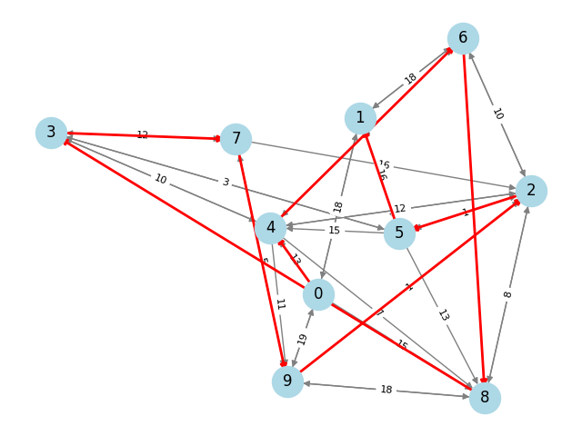

# 📨 Chinese Postman Problem (CPP) com Algoritmos Genéticos

Este repositório contém uma implementação em Python para resolver o **Problema do Carteiro Chinês (CPP)** utilizando **Algoritmos Genéticos (GA)**.  
O projeto inclui geração de instâncias, leitura de arquivos, operadores genéticos e visualização gráfica das soluções.

---

## 📂 Estrutura do Repositório

- **CPP-1.txt**  
  Arquivo de instância do problema, contendo arcos direcionados (`D`) e arestas não direcionadas (`U`).

- **cpp_generation.py**  
  Script para gerar instâncias aleatórias do CPP.

- **reading_cpp.py**  
  Funções para leitura e carregamento das instâncias em um grafo `networkx`.

- **ga_operators.py**  
  Implementação dos operadores genéticos: geração de população, fitness, seleção, crossover, mutação, substituição e visualização.

- **main.py**  
  Script principal para executar o algoritmo genético sobre uma instância do CPP.

---

## ⚙️ Operadores e Funções

| Função                                | Descrição                                                                 |
|---------------------------------------|---------------------------------------------------------------------------|
| `genpop(pop_size, n_nodes)`           | Gera população inicial de permutações de nós.                             |
| `fitness_population(pop, G)`          | Calcula o custo total de cada indivíduo da população.                      |
| `selection(pop_size, fitness)`        | Seleção por torneio (escolhe dois pais com base no fitness).               |
| `order_crossover(parent1, parent2)`   | Crossover OX (Order Crossover), preserva segmento do pai1 e completa com pai2. |
| `mutation_swap(prob_mut, offspring)`  | Mutação por troca (swap) de dois genes com probabilidade `prob_mut`.       |
| `fitness_offspring(individuo, G)`     | Avalia o custo de um único indivíduo (offspring).                          |
| `replacement(pop, fitness, offspring, fitness_off)` | Substitui o pior indivíduo se o filho for melhor. |
| `plot_solution(G, permutation)`       | Visualiza graficamente o grafo e destaca a rota da permutação.             |


## 🛠️ Gerador de Instâncias

O arquivo `cpp_generation.py` gera instâncias aleatórias do CPP.  
Exemplo simplificado:


- `tipo`: `D` (direcionado) ou `U` (não direcionado)  
- `u,v`: nós da aresta/arco  
- `peso`: custo associado  

Exemplo de geração:

```python
import random

n = 10   # número de nós
m = 1    # número de instâncias

for k in range(m):
    file_name = f"CPP-{k+1}.txt"
    with open(file_name, "w") as f:
        f.write("# tipo,u,v,peso\n")
        nodes = list(range(n))

        # Arcos direcionados
        for _ in range(random.randint(n, 2*n)):
            u, v = random.sample(nodes, 2)
            w = random.randint(1, 20)
            f.write(f"D,{u},{v},{w}\n")

        # Arestas não direcionadas
        for _ in range(random.randint(n, 2*n)):
            u, v = random.sample(nodes, 2)
            w = random.randint(1, 20)
            f.write(f"U,{u},{v},{w}\n")

## 📊 Visualização da Solução


