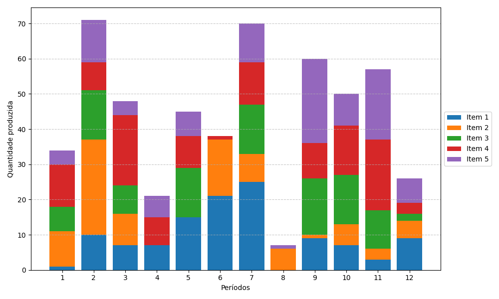

# Genetic Algorithm for Lot Sizing

Este projeto implementa um **Algoritmo Genético (GA)** para resolver o problema de ** *Lot Sizing* com múltiplos itens e múltiplos períodos**.  
O objetivo é minimizar o custo total de produção, estoque e setup, garantindo que a demanda seja atendida ou penalizando quando não for.

---

## 📂 Estrutura dos Arquivos

- **`GA_operators_lot_sizing.py`**  
  Contém a implementação dos operadores genéticos (geração de população, *fitness*, seleção, crossover, mutação, *replacement*, *restart* e plotagem da solução).

- **`lot_sizing_instances.py`**  
  Script para gerar instâncias de *lot sizing* (N itens, T períodos, matrizes de demanda, custos de produção, estoque e setup).

- **`LS-1.txt`**  
  Exemplo de instância gerada, contendo N, T, matriz de demandas e custos.

- **`main.py`**  
  Script principal que executa o algoritmo genético:
  - Gera ou lê instâncias
  - Inicializa a população
  - Executa evolução por várias gerações
  - Aplica operadores genéticos
  - Plota evolução do fitness e solução final

- **`Figure_1.png`**  
  Exemplo de gráfico gerado mostrando a solução do lot sizing para o melhor indivíduo.

---

## ⚙️ Fluxo do Algoritmo

1. **Gerar/Ler instância** (demanda e custos)  
2. **Inicializar população** com cromossomos representando planos de produção  
3. **Avaliar *fitness* ** de cada indivíduo  
4. **Selecionar pais** com base no fitness  
5. **Aplicar crossover e mutação** para gerar filhos  
6. **Avaliar fitness dos filhos**  
7. ** *Replacement* **: substituir indivíduos da população  
8. ** *Restart* (opcional)**: reinicializar população se houver estagnação  
9. **Plotar evolução do fitness** e visualizar solução final  

---

## 🧬 Operadores Genéticos

| Operador | Função | Descrição |
|----------|--------|-----------|
| `genpop_lotsizing` | Inicialização | Gera população inicial. Cada cromossomo é um vetor de tamanho N×T com produções aleatórias até 150% da demanda. |
| `fitness_population` | Avaliação | Calcula custo total de cada indivíduo (produção, estoque, setup e penalização por não atender demanda). |
| `selection` | Seleção | Escolhe dois pais com base nas aptidões (ex.: torneio ou roleta). |
| `uniform_crossover_lotsizing` | Crossover | Gera filho escolhendo gene a gene de cada pai. |
| `mutation_lotsizing` | Mutação | Seleciona item e período. Se produção < demanda total, aumenta; se produção > demanda, reduz. |
| `fitness_offspring_lotsizing` | Avaliação do filho | Calcula o fitness de um único cromossomo (filho gerado). |
| `replacement` | Substituição | Atualiza população substituindo indivíduos menos aptos pelo filho. |
| `restart_operator_lotsizing` | Restart | Reinicializa população se todos os indivíduos tiverem fitness igual, mantendo o melhor indivíduo. |
| `plot_lotsizing_solution` | Visualização | Plota gráfico de barras empilhadas mostrando produção por item em cada período. |

---
## 📊 Exemplo de Solução

A figura abaixo mostra uma solução de *lot sizing* obtida pelo algoritmo genético, com a produção de cada item em cada período representada em barras empilhadas:




Para rodar o algoritmo:

```bash
python main.py
