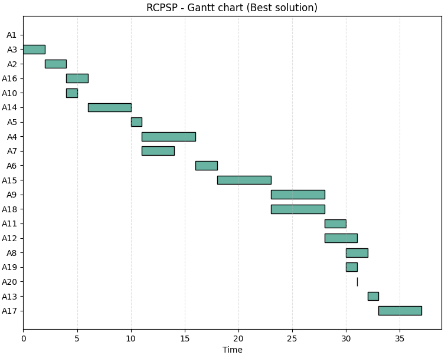
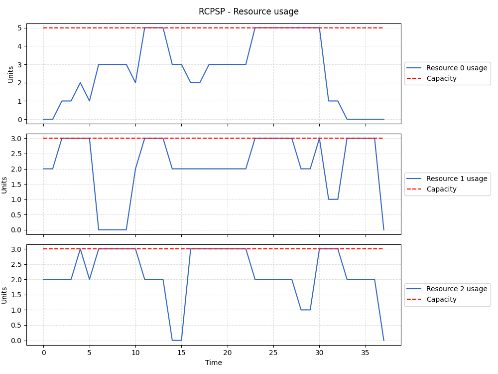

# Algoritmo Evolucionário para RCPSP

Este repositório contém uma implementação em Python de um **Algoritmo Genético** para resolver o **Problema de Programação de Projetos com Restrição de Recursos (RCPSP)**.  
O RCPSP é um problema clássico de otimização em que atividades devem ser escalonadas respeitando precedências e capacidades limitadas de recursos, buscando minimizar o **makespan** (tempo total do projeto).

---
## 📂 Estrutura do Repositório

Este repositório contém os seguintes arquivos:

- **Gantt.png**  
  Diagrama de Gantt gerado pelo algoritmo, mostrando a programação das atividades ao longo do tempo.

- **Resources.png**  
  Gráfico de uso dos recursos comparando consumo e capacidade em cada período.

- **RCPSP-1.txt**  
  Arquivo de instância exemplo do problema RCPSP, contendo número de atividades, recursos, capacidades e precedências.

- **README.md**  
  Documento de descrição do projeto, instruções de uso e explicações sobre o algoritmo.

- **instance_generator.py**  
  Script para gerar instâncias RCPSP automaticamente em formato texto.

- **main.py**  
  Arquivo principal para execução do algoritmo evolucionário sobre uma instância RCPSP.

- **rcpsp_operators.py**  
  Implementação dos operadores evolucionários (seleção, crossover, mutação e substituição) utilizados no algoritmo.

---

## 🚀 Como usar

1. Coloque sua instância RCPSP em formato `.txt` (exemplo: `RCPSP-1.txt`).  
2. Execute o arquivo `main.py` para rodar o algoritmo evolucionário.  
3. Os resultados incluem:  
   - **Makespan** da melhor solução encontrada  
   - **Diagrama de Gantt** (`Gantt.png`)  
   - **Uso dos recursos** (`Resources.png`)  

---

## 📊 Saídas esperadas

- **Gantt.png**: visualização das atividades ao longo do tempo.  
- **Resources.png**: consumo dos recursos vs capacidade.  
- **Console**: impressão do melhor makespan e evolução da população.

## 📊 Resultados Gráficos

Os resultados do algoritmo podem ser visualizados diretamente abaixo:

### Diagrama de Gantt

### Uso dos Recursos

## 📂 Estrutura do Código

O arquivo principal (`rcpsp.py`) contém:

- **Leitura da instância**  
  - `read_instance_rcpsp(file_name)`: lê uma instância em formato texto e retorna número de atividades, recursos, capacidades e dados das atividades.

- **População inicial**  
  - `genpop_rcpsp(pop_size, activities)`: gera uma população inicial de indivíduos (listas de atividades válidas).

- **Avaliação de soluções**  
  - `schedule_generation(individuo, activities, resource_capacities)`: gera cronograma e calcula o makespan.  
  - `fitness_population(pop, activities, resource_capacities)`: avalia toda a população.  
  - `fitness_offspring(individuo, activities, resource_capacities)`: avalia um único indivíduo.

- **Operadores evolutivos**  
  - `selection(pop_size, fitness)`: seleção por torneio.  
  - `ppc_crossover(parent1, parent2, activities)`: crossover preservando precedência.  
  - `mutation_swap(prob_mut, offspring, activities)`: mutação por troca, mantendo precedências.  
  - `replacement(pop, fitness, offspring, fitness_off, activities, resource_capacities)`: substitui o pior indivíduo se o filho for melhor.

- **Visualização**  
  - `plot_gantt(schedule)`: plota diagrama de Gantt da solução.  
  - `plot_resource_usage(resource_usage, resource_capacities)`: plota uso dos recursos ao longo do tempo.  

- **Algoritmo principal**  
  - `evolutionary_algorithm_rcpsp(file_name, pop_size=50, generations=100, prob_mut=0.1)`: executa o algoritmo completo.

---

# Operador de Cruzamento PPC (Precedence Preserving Crossover)

É descrito em detalhes o operador de cruzamento **PPC (Precedence Preserving Crossover)** implementado para o problema **RCPSP (Resource-Constrained Project Scheduling Problem)**.

---

## 📌 Objetivo

O operador PPC tem como finalidade **gerar um novo indivíduo (filho)** a partir de dois pais (`parent1` e `parent2`), garantindo que todas as **restrições de precedência** entre atividades sejam respeitadas.  
Dessa forma, o filho resultante é sempre uma **sequência válida de atividades**.

---

## ⚙️ Funcionamento

1. **Inicialização**  
   - Define o tamanho da lista de atividades (`n`).  
   - Cria uma lista vazia `offspring` para armazenar o filho.  
   - Cria um conjunto `used` para controlar quais atividades já foram inseridas.

2. **Construção do filho**  
   - Enquanto o filho não tiver todas as atividades (`len(offspring) < n`):  
     - Seleciona **candidatos válidos** do `parent1`:  
       - Atividades ainda não usadas.  
       - Todos os predecessores já presentes no `offspring`.  
     - Se não houver candidatos no `parent1`, tenta no `parent2`.  
     - Se ainda assim não houver candidatos, lança erro (`RuntimeError`).

3. **Escolha da atividade**  
   - Alterna entre os pais para guiar a escolha:  
     - Em posições pares → segue ordem do `parent1`.  
     - Em posições ímpares → segue ordem do `parent2`.  
   - A atividade escolhida é adicionada ao `offspring` e marcada como usada.

4. **Finalização**  
   - Após completar todas as posições, retorna o filho (`offspring`) como uma lista válida de atividades.

---

## 🧩 Exemplo Simplificado

Suponha duas listas de atividades (pais):

- `parent1 = [1, 2, 3, 4]`  
- `parent2 = [2, 1, 4, 3]`  

Com precedências:  
- Atividade 2 depende da 1  
- Atividade 3 depende da 2  

O operador PPC irá construir o filho garantindo que:  
- A atividade 1 apareça antes da 2  
- A atividade 2 apareça antes da 3  
- Nenhuma restrição seja violada  

Resultado possível:  
- `offspring = [1, 2, 4, 3]`

---

## ✅ Vantagens

- **Preserva precedências**: nunca gera soluções inválidas.  
- **Combina informações dos dois pais**: alterna entre eles para guiar a construção.  
- **Flexível**: pode ser aplicado em qualquer instância RCPSP com diferentes números de atividades e precedências.

## 📄 Formato da Instância

O arquivo de instância deve seguir o padrão:

# Explicação da Instância RCPSP

Este repositório contém um exemplo de instância do **Problema de Programação de Projetos com Restrição de Recursos (RCPSP)**.

---

## 📋 Estrutura da Instância

- **Número de atividades:** 10  
- **Número de recursos:** 2  
- **Capacidades dos recursos:** [4, 2]  
  - Recurso 1: capacidade máxima = 4 unidades  
  - Recurso 2: capacidade máxima = 2 unidades  

Cada atividade é definida como:  
`id duração r1 r2 ... predecessores`

---

## 🔎 Atividades

| Atividade | Duração | Uso R1 | Uso R2 | Predecessores |
|-----------|---------|--------|--------|---------------|
| 1         | 0       | 0      | 0      | - (nenhum)    |
| 2         | 1       | 4      | 1      | 1             |
| 3         | 1       | 4      | 1      | 2, 1          |
| 4         | 3       | 4      | 2      | 1             |
| 5         | 4       | 2      | 2      | 3             |
| 6         | 4       | 4      | 1      | 5, 4          |
| 7         | 1       | 0      | 0      | 5, 1          |
| 8         | 3       | 2      | 1      | 1, 4, 3       |
| 9         | 5       | 3      | 2      | 3, 2, 7       |
| 10        | 0       | 0      | 0      | 9             |

---

## 🧩 Interpretação

- **Atividades 1 e 10** são *tarefas fictícias* (duração 0, sem uso de recursos).  
  - Atividade 1 = **nó inicial**  
  - Atividade 10 = **nó final**  
- **Atividades intermediárias (2–9)** representam tarefas reais com duração e consumo de recursos.  
- **Predecessores** definem a ordem de execução.  
  - Exemplos:  
    - A2 depende de A1  
    - A3 depende de A2 e A1  
    - A6 depende de A5 e A4  
    - A9 depende de A3, A2 e A7  
    - A10 depende de A9  

---

## 🔗 Grafo de Precedência (simplificado)

- A1 → A2 → A3 → A5 → A6 → A10  
- A1 → A4 → A6 → A10  
- A1 → A7 → A9 → A10  
- A1 → A8 → A10  
- A2 → A9 → A10  

---

## ⚡ Observações

- O uso de recursos é **alto** em várias tarefas (A2, A3, A4, A6), muitas vezes atingindo a capacidade máxima do Recurso 1 (4 unidades).  
- Isso força o escalonamento sequencial em vez da execução paralela.  
- As atividades fictícias (A1, A10, A7) estruturam o grafo, mas não afetam diretamente o makespan.  
- O **makespan ótimo** depende de como o algoritmo aloca recursos respeitando as precedências.  

---

👉 Em resumo:  
Esta instância é um **projeto pequeno (10 atividades)** com **2 recursos limitados**, onde várias tarefas competem pela capacidade máxima do Recurso 1. O desafio é encontrar um cronograma que respeite todas as precedências e minimize a duração total do projeto (makespan).
