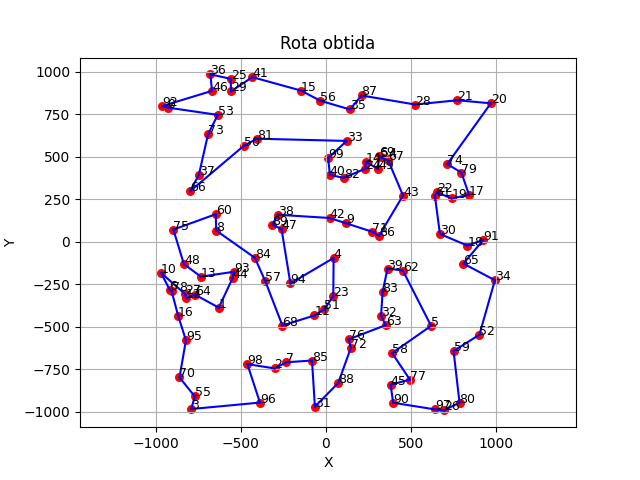

# 📌 GRASP + VNS + SA para o Problema do Caixeiro Viajante (TSP)

Este repositório implementa uma heurística híbrida combinando **GRASP (Greedy Randomized Adaptive Search Procedure)**, **VNS (Variable Neighborhood Search)** e **SA (Simulated Annealing)** para resolver instâncias do **Problema do Caixeiro Viajante (TSP)**.  

O algoritmo busca soluções de alta qualidade explorando diferentes vizinhanças e aplicando reinicializações quando não há melhoria após várias iterações.

---

## 📂 Estrutura do Repositório

- **`main.py`** → Script principal que executa o algoritmo GRASP + VNS + SA.  
- **`grasp_vns_sa_operators.py`** → Implementação das funções auxiliares: leitura de instâncias, cálculo de distâncias, função objetivo, busca local 2-opt e operadores de vizinhança.  
- **`tsp_reading.py`** → Funções para leitura de instâncias TSP.  
- **`tsp_generation.py`** → Funções para geração de instâncias TSP.  
- **`TSP-1.txt` / `TSP-2.txt`** → Instâncias de teste do problema (coordenadas das cidades).  
- **`Figure_1.png`** → Exemplo de rota obtida pelo algoritmo.  

---

## 🔧 Operadores de Vizinhança

| Operador              | Descrição                                                                 |
|-----------------------|---------------------------------------------------------------------------|
| `node_exchange`       | Troca dois nós da rota (swap simples).                                   |
| `node_insertion`      | Move um nó para o início da rota.                                        |
| `node_series_exchange`| Divide a rota em duas partes e troca a ordem delas.                      |
| `node_series_move_one`| Move um bloco de 4 nós para o início da rota.                            |
| `node_series_move_two`| Move um bloco de 4 nós para o final da rota.                             |
| `node_shift`          | Seleciona um bloco de nós e insere em posição aleatória da rota.         |

## ⚙️ Parâmetros Principais

- **GRASP**  
  - `alpha_grasp = 0.3` → controla o grau de aleatoriedade na fase de construção.  

- **Simulated Annealing (SA)**  
  - `T_0 = 1000` → temperatura inicial.  
  - `T_f = 0.01` → temperatura final.  
  - `alpha = 0.95` → fator de resfriamento.  

- **Iterações e reinicialização**  
  - `max_iter = 1000` → número máximo de iterações.  
  - `max_no_improve = 0.05 * max_iter` → reinicializa após 5% das iterações sem melhoria.  

## 📊 Exemplo de Saída

- Evolução da melhor solução ao longo das iterações:

- Plotagem da rota final obtida pelo algoritmo (cidades em vermelho, rota em azul).

