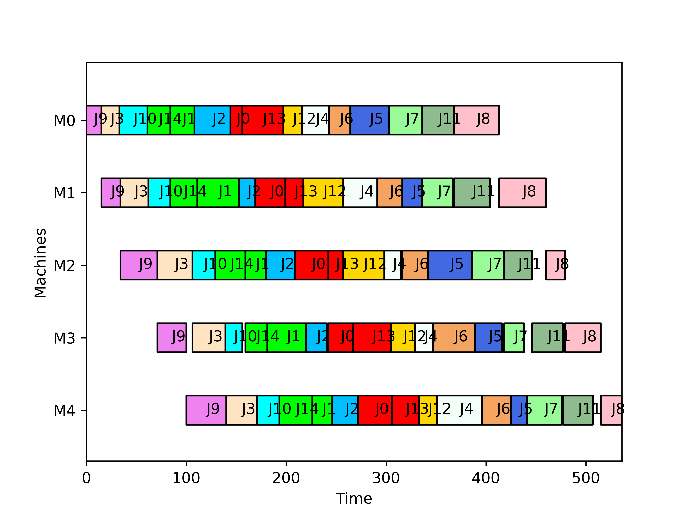

# Iterated Greedy para Flow Shop com Minimização do Atraso Total

Este repositório contém a implementação de um algoritmo **Iterated Greedy (IG)** para o problema de **Flow Shop Scheduling**, com objetivo de minimizar o **atraso total (Total Tardiness)**.  

O método combina heurísticas clássicas (EDD, NEH), operadores de destruição/construção e busca local (2-opt), dentro de um esquema de **Simulated Annealing**.

---

## 📂 Estrutura dos Arquivos

- `main.py` → Script principal que executa o algoritmo IG.
- `ig_operators.py` → Implementação dos operadores (heurísticas, destruição/construção, busca local).
- `instance.txt` → Arquivo de instância com tempos de processamento e datas de entrega.
- `Tardiness.png` → Gráfico gerado com o cronograma da melhor solução encontrada.

---

## ⚙️ Funcionamento

1. **Leitura da instância** via `FlowShop`.
2. **Solução inicial** construída com:
   - **EDD (Earliest Due Date)** → ordena jobs por data de entrega.
   - **NEH heuristic** → refina a sequência inicial.
3. **Iterated Greedy loop**:
   - **Destruição**: remove parte da sequência.
   - **Construção**: reinsere jobs nas melhores posições.
   - **Busca local (2-opt)**: melhora a solução.
   - **Critério de aceitação**: Simulated Annealing.
4. **Resultado final**:
   - Melhor sequência encontrada.
   - Valor do atraso total.
   - Gráfico da evolução do tardiness.

---

## 🧩 Operadores Implementados

| Operador | Função | Descrição |
|----------|--------|-----------|
| **EDD** | `EDD(d)` | Ordena os jobs pela menor data de entrega (Earliest Due Date). |
| **Construction** | `construction(pi_D, pi_P, ...)` | Insere os jobs destruídos de volta na sequência parcial, escolhendo posições que minimizam o atraso. |
| **Destruction** | `destruction(pi_0, k_destruction)` | Remove aleatoriamente `k` jobs da sequência atual. |
| **Temperature Calculation** | `calculate_temperature(P, tal)` | Calcula a temperatura inicial para o critério de aceitação (Simulated Annealing). |
| **Tardiness Function** | `tardiness(Pi, P, d, M, N)` | Avalia o atraso total da sequência. |
| **NEH Heuristic** | `NEH(alpha, P, d, M, N, objective_fn)` | Constrói uma solução inicial refinada usando inserções iterativas. |
| **2-opt Local Search** | `two_opt_best_improvement(Pi, ...)` | Aplica busca local trocando pares de jobs para reduzir o atraso. |

---

## 📈 Gráfico de Gantt

A figura abaixo mostra o diagrama de Gantt para uma solução gerada:

