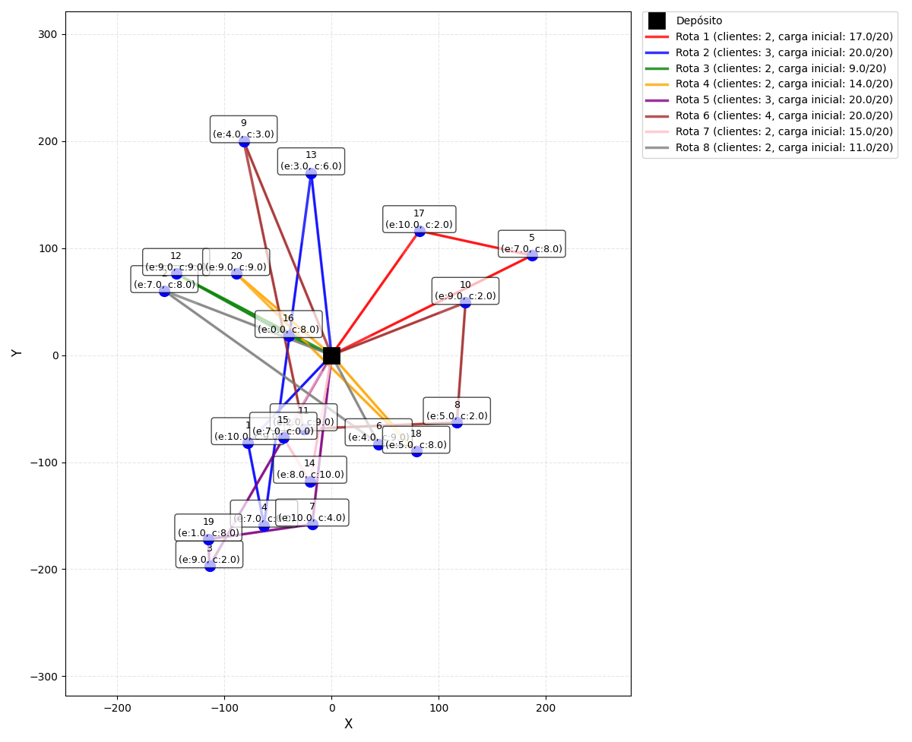

# Iterated Local Search (ILS) para VRP com Pickup and Delivery (VRPPD)

Este projeto implementa um **Iterated Local Search (ILS)** para resolver o problema de **Vehicle Routing Problem com Pickup and Delivery (VRPPD)**.  
O objetivo é minimizar a distância total percorrida pelos veículos, respeitando a capacidade e as restrições de coleta e entrega.

---

## 📂 Estrutura dos Arquivos

- **`ILS_operators_VRPPD.py`**  
  Implementa os operadores do ILS (leitura da instância, avaliação de rotas, perturbação, busca local e plotagem).

- **`instance_generation.py`**  
  Script para gerar instâncias do VRPPD.

- **`VRPPD-1.txt`**  
  Exemplo de instância contendo clientes, coordenadas, demandas de entrega e coleta.

- **`main.py`**  
  Script principal que executa o algoritmo:
  - Lê instância
  - Gera solução inicial aleatória
  - Avalia custo e viabilidade
  - Executa perturbações e busca local
  - Aceita melhorias
  - Plota evolução da função objetivo e rotas finais

  ## 📊 Exemplo de Solução

Exemplo de solução gerada pelo algoritmo, mostrando as rotas finais.

---

## ⚙️ Fluxo do Algoritmo

1. **Leitura da instância** (`vrppd_reading`)  
2. **Geração da solução inicial** (rota aleatória)  
3. **Avaliação da rota** (`route_cost`)  
4. **Perturbação** (`perturbation`)  
5. **Flatten obrigatório** (`flatten_routes`)  
6. **Busca local** (`two_opt_pdvrp`)  
7. **Aceitação da nova solução** se houver melhoria  
8. **Iterações** até atingir o número máximo definido  
9. **Plotagem** da evolução da função objetivo e das rotas finais  

---

## 🧩 Operadores ILS para VRPPD

| Operador | Função | Descrição |
|----------|--------|-----------|
| `vrppd_reading` | Leitura | Lê a instância do VRPPD a partir de arquivo `.txt`. |
| `route_cost` | Avaliação | Calcula o custo total da rota e verifica viabilidade (capacidade e restrições). |
| `flatten_routes` | Normalização | Garante que a rota esteja em formato linear para avaliação. |
| `perturbation` | Perturbação | Aplica uma modificação aleatória na rota para escapar de ótimos locais. |
| `two_opt_pdvrp` | Busca local | Aplica o movimento 2-opt adaptado ao VRPPD para melhorar a solução. |
| `plotting_route_pick_up_and_delivery` | Visualização | Plota graficamente as rotas finais com clientes e depósito. |

---

