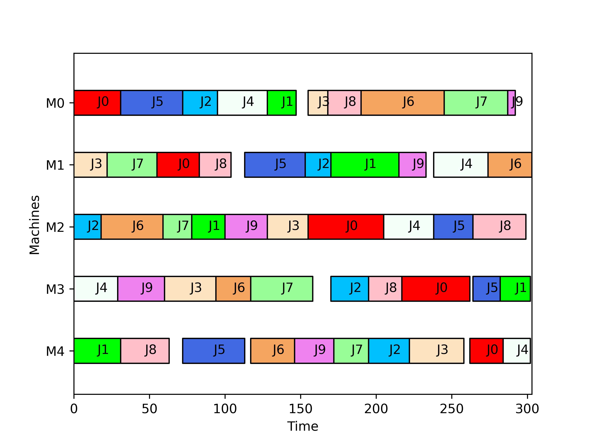

# 🔎 Tabu Search para Job Shop Scheduling Problem (JSSP)

Este repositório implementa um algoritmo de **Busca Tabu** para resolver instâncias do **Job Shop Scheduling Problem (JSSP)**.  
O objetivo é minimizar o **makespan** (tempo total de conclusão) através da exploração de vizinhanças de soluções e uso de uma lista tabu para evitar ciclos.

---

## 📂 Estrutura do Projeto

- **`main.py`** → Script principal que executa o algoritmo de Busca Tabu.
- **`ts_operators.py`** → Funções auxiliares para geração de vizinhos e seleção da melhor solução.
- **`instance.txt`** → Arquivo de instância do problema (definição de jobs, máquinas, tempos de processamento e roteiros).
- **`Makespan.png`** → Gráfico gerado mostrando o melhor cronograma encontrado.

---

## 📈 Gráfico de Gantt - Makespan

