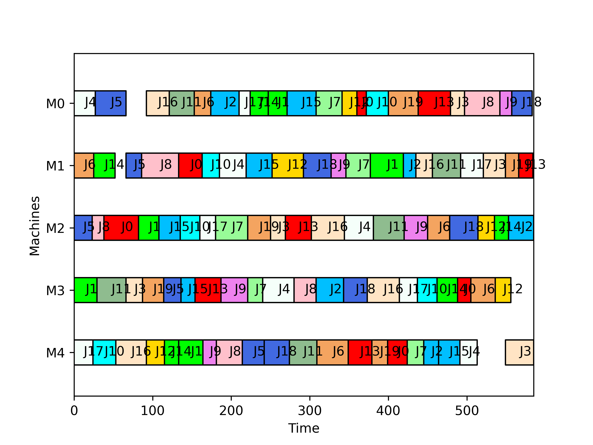

# VNS para Problema de Escalonamento (Open Shop)

Este repositório implementa uma metaheurística **Variable Neighborhood Search (VNS)** para resolver instâncias de problemas de escalonamento (scheduling).  
O objetivo é minimizar o **makespan** (tempo total de conclusão) de um conjunto de tarefas em máquinas.

---

## Estrutura do Repositório

- **`main.py`** → Script principal que executa o VNS sobre a instância definida em `instance.txt`.  
- **`vns_operators.py`** → Implementação dos operadores de vizinhança utilizados pelo VNS.  
- **`instance.txt`** → Arquivo de entrada contendo a instância do problema.  
- **`Makespan.png`** → Gráfico gerado mostrando a evolução do makespan ao longo das iterações.  

---

## Operadores de Vizinhança (VNS)

Os operadores implementados em `vns_operators.py` são responsáveis por gerar soluções vizinhas a partir de uma solução corrente.  
A tabela abaixo descreve cada operador:

| Operador              | Descrição                                                                 |
|------------------------|---------------------------------------------------------------------------|
| **`job_exchange`**     | Troca dois elementos aleatórios de posição na sequência.                  |
| **`job_insertion`**    | Move um elemento aleatório para o início da sequência.                    |
| **`job_series_exchange`** | Divide a sequência em duas partes e troca a ordem delas, mantendo a ordem interna. |
| **`job_series_move_one`** | Seleciona um bloco de 4 elementos consecutivos e move-o para o início da sequência. |
| **`job_series_move_two`** | Seleciona um bloco de 4 elementos consecutivos e move-o para o final da sequência. |

Essas vizinhanças permitem explorar diferentes regiões do espaço de soluções, aumentando a chance de encontrar soluções melhores.

---

## 🎨 Visualização

Exemplo de saída gráfica:

